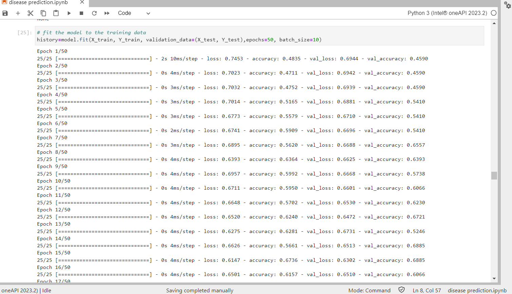
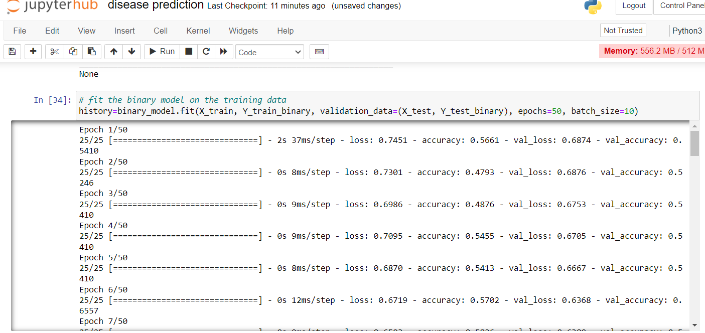

    <centre><h1>CARDIOVASCULAR RISK PREDICTION</centre> 
       

 
 
       
 

   
 

  Cardiovascular Risk prediction is crucial for improving health outcomes, saving lives, reducing healthcare costs, and promoting a healthier society.The leading cause of death in the developed world is heart 
  disease. 
 Therefore there needs to be work done to help prevent the risks of of having a heart attack or stroke.

 <h2>ABOUT</h2>
 
 **What is Cardiovascular Risk Prediction?**
 
 Cardiovascular Risk prediction involves analyzing various health-related factors and historical data to predict the likelihood of a person experiencing cardiovascular problems or heart-related conditions in the future.
 
 
 **Importance of Cardiovascular Risk Prediction**
 <li>Predicting heart disease risk allows for early intervention.</li> 
 <li>Heart disease is a leading cause of death worldwide. Accurate prediction models can help reduce mortality rates by identifying high-risk individuals who can then receive timely medical attention and 
     lifestyle guidance.</li>
 <li>Preventing heart disease is more cost-effective than treating advanced stages of the disease. </li>

 
 <h2>TECHNOLOGIES USED</h2>
 

     
 

 
 The [Intel® OneAPI toolkit](https://www.intel.com/content/www/us/en/developer/tools/oneapi/toolkits.html#gs.3btkxe), [Intel® TensorFlow ](https://www.intel.com/content/www/us/en/developer/articles/guide/optimization-for-tensorflow-installation-guide.html) enables models to be trained in a more efficient way and results in faster training times. 
 
 
 
 
 
 <h2>METHODOLOGY</h2>
 <li>The model was trained using individuals age,sex,cholestrol level,Fasting Blood sugar and so on to enhance its technical proficiency.
 </li>
 <li>  Keras is a popular deep learning framework that provides a high-level interface for building and training neural networks. While traditional machine learning algorithm like logistic regression is often used for heart disease prediction</li>
 

 
 <h2>PLATFORMS</h2>
 
 
 **CODES IN DIFFERENT PLATFORMS:**
 
 It tooks nearly  2 seconds to  37 milliseconds to run single keras model files in Jupyterhub.
 But in OPENVINO it took 2 milliseconds to 10 milliseconds to run it where this keras model consist of 50 files to run it and make to fit for the model.
 
  
 

    <centre><h2> openVINO notebook</centre> 
       

       

          
      

 
 

    <centre><h2>local machine's notebook
 </centre> 
       

      

          
      

 
 
